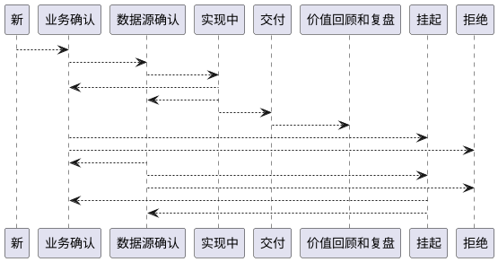

这里可以记录常规的无法分类的信息。

# 1. docsify介绍

docsify 是一个动态生成文档网站的工具。不同于 GitBook、Hexo 的地方是它不会生成将 .md 转成 .html 文件，所有转换工作都是在运行时进行。

这将非常实用，如果只是需要快速的搭建一个小型的文档网站，或者不想因为生成的一堆 .html 文件“污染” commit 记录，只需要创建一个 index.html 就可以开始写文档而且直接部署在 GitHub Pages。

他是一个很好用的工具。

# 2. 环境配置

docsify-cli 工具，可以方便创建及本地预览文档网站。

2.2.1 安装
docsify需要本地先安装node, 如果没有安装node，可在node官网选择对应操作系统下载安装：https://nodejs.org/zh-cn/

# 3. 启动服务

终端输入

> docsify s

# 4. markdown 语法和数学公式支持

只需要用 `$$` 就可以获得数学环境

$$
a^2 + b^2 = 1
$$

以及行内公式，$\beta^2 = 3$

还有如何把冗长的公式复制过来，要用到神器 **Mathpix Snipping tool**，来看看效果：

$$
\pi_{i, j}=\exp \left(-\frac{c_{i, j}}{\gamma}\right) \exp \left(-\frac{\alpha_{j}}{\gamma}\right) \exp \left(-\frac{\beta_{i}}{\gamma}\right)
$$

又一个公式：

$$
\begin{aligned}
&\frac{\partial C^{*}}{\partial r}=\log (u) / \lambda \\
&\frac{\partial C^{*}}{\partial c}=\log (v) / \lambda
\end{aligned}
$$

# 5. plantuml 的支持

已拒绝和挂起两种状态不做更多的赘述。最后我们再看看这 8 个状态的流转关系：

以上描述的是一个数据需求的状态定义和流转过程。反复多轮之后，分析师必须通过问题的分解和合并技巧，以及价值排序判断，形成自己的业务知识图谱，这项能力是不可复制的，切记！

# 6. 插入图片

和一般性的 markdown 语法一致：

你也可以盗图：

